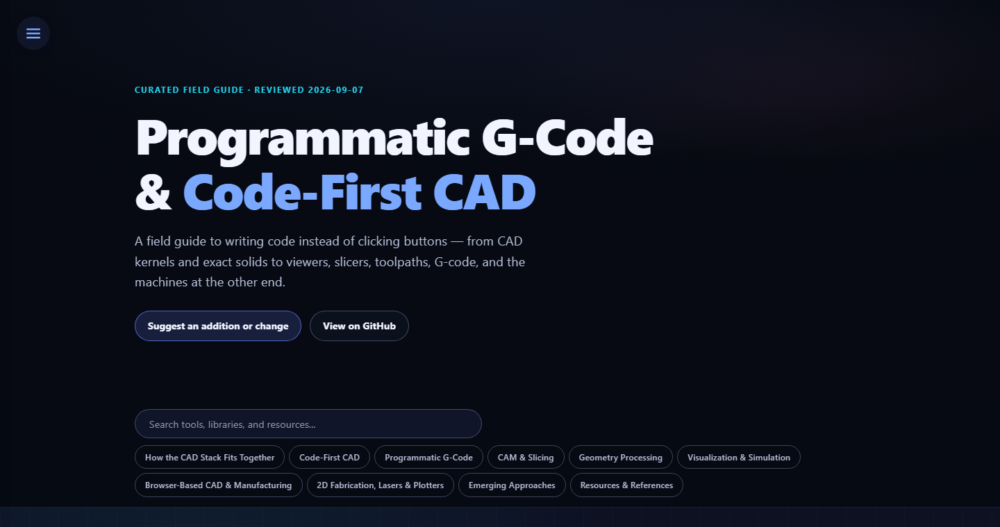

# Cool Code CAD

[](https://kylegrover.github.io/cool-code-cad/)

A curated list of code-first CAD, geometry kernels, G-code tooling, CAM, slicing, visualization, simulation, and programmatic manufacturing.

**[Browse the interactive field guide](https://kylegrover.github.io/cool-code-cad/) · [Suggest an addition or change](https://github.com/kylegrover/cool-code-cad/issues/new?template=catalog-suggestion.yml) · [Read the plain-text edition](llm.txt)**

205 catalog entries · Last reviewed **2026-09-07**

> This catalog is a starting point, not a compatibility guarantee or endorsement. G-code is controller- and firmware-specific; verify commands, units, coordinate systems, limits, and safety behavior before running generated output.

## Contents

- [How the CAD Stack Fits Together](#catalog-cad-pipeline)
- [Code-First CAD](#catalog-code-cad)
  - [B-Rep / Solid Modeling](#catalog-brep)
  - [CSG & Mesh-Based](#catalog-csg-mesh)
  - [SDF & Implicit Modeling](#catalog-sdf-implicit)
  - [Visual & Node-Based](#catalog-visual-node)
  - [Blender as CAD](#catalog-blender-cad)
  - [Rust CAD Kernels](#catalog-rust-kernels)
- [Programmatic G-Code](#catalog-gcode-gen)
  - [G-Code Generation & Processing Libraries](#catalog-gcode-libs)
  - [G-Code IDEs & Editors](#catalog-gcode-ides)
- [CAM & Slicing](#catalog-cam-slicing)
  - [Open-Source Slicers](#catalog-slicers)
  - [CAM / Toolpath Generation](#catalog-cam-toolpath)
  - [Laser CAM & Control](#catalog-laser-cam)
  - [PCB Milling (Gerber to G-Code)](#catalog-pcb-milling)
  - [CNC Firmware & Control](#catalog-cnc-firmware)
- [Geometry Processing](#catalog-geometry)
  - [Geometry Kernels & Engines](#catalog-kernels)
  - [Mesh Processing Libraries](#catalog-mesh-libs)
  - [File Format & Interchange](#catalog-file-format)
- [Visualization & Simulation](#catalog-viz-sim)
  - [Web-Based G-Code Viewers](#catalog-gcode-web-viewers)
  - [JavaScript / npm Libraries](#catalog-gcode-npm)
  - [Desktop Viewers & Senders](#catalog-gcode-desktop)
  - [Klipper / OctoPrint Interfaces](#catalog-gcode-klipper)
  - [Python G-Code Libraries](#catalog-gcode-python)
  - [Rust G-Code Crates](#catalog-gcode-rust)
  - [VS Code Extensions](#catalog-gcode-vscode)
  - [CNC Editors & Backplotters](#catalog-cnc-editors)
  - [Blender G-Code Integration](#catalog-blender-gcode)
  - [Enterprise CNC Simulation](#catalog-enterprise-cnc)
  - [3D Print Simulation](#catalog-print-sim)
  - [AI Print Monitoring & Failure Detection](#catalog-ai-monitoring)
  - [General FEA / CFD Foundations](#catalog-fea-cfd)
- [Browser-Based CAD & Manufacturing](#catalog-browser-cad)
  - [Projects and resources](#catalog-browser-tools)
- [2D Fabrication, Lasers & Plotters](#catalog-plotter)
  - [Projects and resources](#catalog-plotter-tools)
- [Emerging Approaches](#catalog-emerging)
  - [Agent-Ready CAD Loops](#catalog-agent-cad-loops)
  - [AI-Assisted CAD](#catalog-ai-cad)
  - [Topology Optimization & Generative Design](#catalog-topology-opt)
  - [Creative Coding for Fabrication](#catalog-creative-coding)
  - [Julia Ecosystem](#catalog-julia-cad)
- [Resources & References](#catalog-resources)
  - [G-Code & Firmware](#catalog-gcode-refs)
  - [Meta-Lists & Communities](#catalog-meta-lists)

<a id="catalog-cad-pipeline"></a>

## How the CAD Stack Fits Together

A CAD product is a stack, not one magic program. Authoring captures intent and a kernel evaluates it into a model. Inspection, interchange, and manufacturing are separate downstream uses of that model—not required steps in one linear pipeline.

### The stack in brief

- **Author: Describe the thing** — Dimensions, constraints, features, code, or an AI prompt capture what the part is supposed to be.
- **Evaluate: Build geometry** — A geometry kernel evaluates booleans, fillets, intersections, topology, tolerances, and measurements.
- **Inspect: Tessellate for display** — The exact model is converted to display triangles. The viewport is the window into the model, not usually the model itself.
- **Exchange: Choose what survives** — STEP can preserve analytic surfaces and topology; STL/3MF commonly carry tessellated surfaces. DXF/SVG are primarily used for 2D/vector exchange, though DXF can also contain 3D entities.
- **The model: Source of truth** — Authoring intent plus kernel evaluation produce the representation the application works from.
- **Manufacture: When geometry becomes a manufacturing plan** — Slicers and CAM turn geometry into machine motion; direct toolpath systems can generate motion without conventional CAD/CAM.

### Manufacturing routes

- **3D printing** — Model / mesh → Slicer → Toolpath / G-code → Printer firmware → Printed part (Layer-by-layer deposition)
- **CNC machining** — Model geometry / STEP → CAM → Toolpath / G-code → Machine controller → Machined part (Material removal)
- **Programmatic toolpaths** — Geometry code → Path generator → Toolpath / G-code → Controller → Physical output (Can bypass a conventional CAD/CAM model)

<a id="catalog-code-cad"></a>

## Code-First CAD

Design 3D models by writing code instead of clicking in a GUI. Parametric, reproducible, version-controllable. See also the <a href="https://github.com/Irev-Dev/curated-code-cad" target="_blank" rel="noopener">curated-code-cad</a> list.

<a id="catalog-brep"></a>

### B-Rep / Solid Modeling

Boundary Representation is the dominant approach in mechanical CAD. These tools build geometry from faces, edges, and vertices — many backed by the Open CASCADE Technology (OCCT) kernel.

- [CadQuery](https://github.com/CadQuery/cadquery) — Mature Python parametric CAD on OpenCASCADE. CadQuery 2.8 moved to OCP 7.9, made its free-function API non-experimental, added experimental modeling-history support, a separate B-spline geometry layer, and unit-aware STEP import/export. See also <a href="https://github.com/CadQuery/awesome-cadquery" target="_blank" rel="noopener">awesome-cadquery</a>. _(Python · Apache-2.0)_
- [CQ-editor](https://github.com/CadQuery/CQ-editor) — CadQuery's cross-platform PyQt workbench with automatic source reload, an OCCT viewport, object-stack inspection, STEP/STL export, and a graphical debugger that can step through a script while the model evolves. It can feel old-school and packaging remains a pain point, but the project and wiki were actively maintained in 2026—not abandoned. _(Python, PyQt · Apache-2.0)_
- [OCP CAD Viewer](https://github.com/bernhard-42/vscode-ocp-cad-viewer) — Actively maintained VS Code and standalone viewer for CadQuery, build123d, and OCP models. The 4.x line adds B-Rep-backed measurements and inspection, PBR materials, screenshots, visual debugging, selection tools, and automatic reload — much more than a passive triangle viewer. _(VS Code · Open Source)_
- [PLaSM](http://www.plasm.net/) — Open source scripting language for solid modeling, developed by the CAD group at the Universities Roma Tre and La Sapienza. Emphasizes scripting over GUI, supporting complex 2D/3D objects, advanced curves, Boolean operations, and geometric transformations. Used for academic and architectural modeling, notably for ancient Roman architecture. _(C++, Python · GPL)_
- [Build123d](https://github.com/gumyr/build123d) — Pythonic B-Rep modeling evolved from CadQuery, with algebra and context-manager builder APIs that work well with ordinary Python control flow. v0.11 moved to OCP 7.9 without a transitive VTK dependency, expanded intersections and constrained geometry, and added DXF import and broader file-object export. The project is actively defining its stable 1.0 baseline. See <a href="https://github.com/gumyr/bd_warehouse" target="_blank" rel="noopener">bd_warehouse</a> for a parametric parts library. _(Python · Apache-2.0)_
- [pythonOCC](https://github.com/tpaviot/pythonocc-core) — Low-level Python bindings to nearly all OpenCASCADE classes. STEP/IGES/STL/GLTF I/O. 400+ academic citations. _(Python · Open Source)_
- [FreeCAD](https://github.com/FreeCAD/FreeCAD) — Full parametric CAD application with deeply integrated Python API and macro system. Nearly every GUI action is scriptable, and full headless Python automation is standard in manufacturing pipelines. _(Python, C++ · Open Source)_
- [Dune3D](https://dune3d.org/) — Actively developed GUI-first parametric CAD, originally built for 3D-printed enclosures. It pairs a SolveSpace-derived constraint solver with OpenCASCADE, has fillets/chamfers and a notably fluid non-modal sketcher, but still lacks a dedicated code/model API; included as a strong GUI-centric comparison point. _(C++, Gtk4 · Open Source)_
- [SolveSpace](https://solvespace.com/) — Lightweight parametric 2D/3D CAD with a powerful geometric constraint solver. Also exposes notebooks and Python bindings (slvs_py / python-solvespace) for programmatic constraint solving. _(C++, Python · Open Source)_
- [BRL-CAD](https://brlcad.org/) — Classic command-line-driven CSG kernel with strong shell/Tcl scriptability. Includes MGED GUI, ray tracing, and mature geometric analysis tools. Legacy but powerful for scripted CSG workflows. _(C, Tcl · Open Source)_
- [Replicad](https://replicad.xyz/) — TypeScript B-Rep modeling on opencascade.js, with a live browser Studio, parameters, dimension labels, STEP import/export, and an official Node CLI that evaluates source files and exports STEP, STL, JSON, or SVG projections. A particularly small source-backed loop for browser agents: model.js stays canonical while Studio supplies the viewport. _(TypeScript, WASM · Open Source)_
- [oscad (openscad-occt)](https://github.com/dnewcome/openscad-occt) — Very young clean-room experiment pairing an OpenSCAD-style declarative language with OCCT B-Rep output. It already demonstrates exact STEP export, B-Rep booleans, query-selected fillets, and datum-like <code>attach()</code>, but covers only a subset of OpenSCAD and has no preview GUI yet. Public source; no license file was listed when reviewed. _(C++, OCCT · No license stated)_
- [cqparts](https://github.com/cqparts/cqparts) — Assembly framework for CadQuery. Define parametric parts and assemblies with constraints. BOM generation, exploded views, STEP export. Think "CadQuery for multi-part designs." _(Python · Open Source)_
- [Topologic](https://github.com/wassimj/Topologic) — Spatial modeling library supporting non-manifold topology for architecture and engineering. Integrates with Blender (via Sverchok), Dynamo, and Python. Academic roots. _(C++, Python · Open Source)_

<a id="catalog-csg-mesh"></a>

### CSG & Mesh-Based

Constructive Solid Geometry combines primitives with boolean operations. These tools work directly with meshes or CSG trees.

- [OpenSCAD](https://openscad.org/) — The original code-CAD tool. Custom DSL for CSG modeling. Now integrating the Manifold engine for ~100x speedups. See also <a href="https://github.com/SolidCode/SolidPython" target="_blank" rel="noopener">SolidPython</a> for a Python frontend. _(OpenSCAD DSL · Open Source)_
- [PythonSCAD](https://pythonscad.org/) — Python integration for OpenSCAD that adds variable mutation, loops, file I/O, and access to the full Python ecosystem while generating OpenSCAD geometry. _(Python, OpenSCAD · Open Source)_
- [SolidPython2](https://github.com/jeff-dh/SolidPython) — Python frontend for OpenSCAD. Write Python, generate .scad files. v2 adds operator overloading, chained transforms, and an improved API over the original SolidPython. _(Python · Open Source)_
- [BOSL2](https://github.com/BelfrySCAD/BOSL2) — The Belfry OpenScad v2 Library — massive standard library for OpenSCAD. Threading, beziers, rounding, joints, hinges, gears, polyhedra, and much more. Essential for serious OpenSCAD work. _(OpenSCAD · Open Source)_
- [NopSCADlib](https://github.com/nophead/NopSCADlib) — OpenSCAD library of common 3D printer/CNC parts: vitamins (screws, bearings, stepper motors, etc.), printed parts, and assemblies. Auto-generates BOMs and assembly instructions. _(OpenSCAD · Open Source)_
- [JSCAD (OpenJSCAD)](https://github.com/jscad/OpenJSCAD.org) — Modular browser and CLI tools for parametric 2D/3D designs with JavaScript. Exports STL, DXF, SVG. V3 in development. _(JavaScript · MIT)_
- [Manifold](https://github.com/elalish/manifold) — High-performance geometry library for guaranteed-manifold mesh booleans, used as OpenSCAD's fast Manifold backend. Its commonly shipped path is multi-core CPU/TBB; CUDA work exists but is not the default GPU-native engine older summaries implied. Official C++, Python, JavaScript, and WASM surfaces. See <a href="https://manifoldcad.org/" target="_blank" rel="noopener">ManifoldCAD</a> for a browser editor. _(C++, JS, Python, WASM · Open Source)_
- [MicroCAD](https://codeberg.org/microcad/microcad) — Description language for parameterizable geometric objects, compiled to STL/SVG. Funded by the German Prototype Fund (2025). _(Rust · Open Source)_
- [ShapeScript](https://github.com/nicklockwood/ShapeScript) — Mac/iOS app for creating 3D models using a simple scripting language. CSG operations, extrusion, lathe, loft, fill, text. Exports STL, DAE, OBJ, SCN, 3MF. _(Swift · Open Source)_

<a id="catalog-sdf-implicit"></a>

### SDF & Implicit Modeling

Represent shapes as mathematical distance functions. Smooth booleans, real-time GPU rendering, and unique modeling workflows. Increasingly relevant for generative manufacturing.

- [Fidget](https://github.com/mkeeter/fidget) — Blazing-fast implicit surface evaluation by Matt Keeter. Hand-written JIT compiler (aarch64/x86_64), interval evaluation, Manifold Dual Contouring meshing. Successor to libfive. _(Rust · Open Source)_
- [libfive](https://github.com/libfive/libfive) — Infrastructure for solid modeling using f-rep (implicit functions). Includes "Studio" GUI for live-coding with Python or Guile. By Matt Keeter. _(C++, Python, Guile · Open Source)_
- [ImplicitCAD](https://github.com/Haskell-Things/ImplicitCAD) — Math-inspired programmatic CAD in Haskell. CSG, bevels, shells, 2D G-code generation. OpenSCAD-like syntax with Haskell extensibility. _(Haskell · Open Source)_
- [Curv](https://github.com/curv3d/curv) — Open-source language for making art using mathematics. SDF shapes, full color, animation, 3D printing export. GPU-accelerated. _(C++, GLSL · Open Source)_
- [sdf (fogleman)](https://github.com/fogleman/sdf) — Simple SDF mesh generation in Python with Marching Cubes. NumPy-accelerated, multi-threaded. Compact and easy to use. _(Python · Open Source)_
- [sdfx](https://github.com/deadsy/sdfx) — SDF-based CAD kernel in Go. Supports fillets and chamfers. _(Go · Open Source)_
- [SDF Modeler](https://sascha-rode.itch.io/sdf-modeler) — Desktop 3D modeler with non-destructive procedural SDF workflow. Auto-retopology, mesh export, vertex colors. Free for commercial use. _(Desktop · Free)_
- [SDFeditor](https://sleditor.com/lab/sdfeditor/) — Experimental node-graph web editor for composing SDF scenes. The author describes this version as a useful but clunky prototype, so expect rough edges. _(Browser · Free)_
- [editSDF](https://stephaneginier.com/archive/editSDF/) — SDF field editor by Stephane Ginier (creator of <a href="https://github.com/stephomi/sculptgl" target="_blank" rel="noopener">SculptGL</a> / <a href="https://nomadsculpt.com/" target="_blank" rel="noopener">Nomad Sculpt</a>). _(Browser · Free)_
- [Inigo Quilez](https://iquilezles.org/) — The definitive resource for SDF primitives, operators, and raymarching techniques. Essential reading. _(GLSL, Reference)_
- [nTopology](https://www.ntop.com/) — Commercial computational design using implicit modeling with field-driven geometry. Aerospace, medical, automotive. Not open source. _(Commercial · Proprietary)_

<a id="catalog-visual-node"></a>

### Visual & Node-Based

Program geometry through visual dataflow graphs instead of text code. Connect nodes to build parametric pipelines.

- [Grasshopper (Rhino)](https://www.rhino3d.com/features/#grasshopper) — Graphical algorithm editor included with Rhino for building parametric models without writing all of the logic as text code. It also supports Python and C# scripting and a broad third-party component ecosystem. _(Rhino, C#, Python · Proprietary)_
- [Blender Geometry Nodes](https://docs.blender.org/manual/en/latest/modeling/geometry_nodes/index.html) — Built-in node-based geometry system in Blender. Procedural modeling, scattering, mesh operations, simulation. Rapidly evolving — a serious parametric design tool. _(Blender · Open Source)_
- [Sverchok](https://github.com/nortikin/sverchok) — Powerful parametric design addon for Blender. 500+ nodes for generative art, architecture, engineering. Often compared to Grasshopper. Python-scriptable nodes. _(Blender, Python · Open Source)_
- [Antimony](https://github.com/mkeeter/antimony) — Node-based CAD tool by Matt Keeter (creator of libfive/Fidget). Graph-based design with implicit functions. Long-term maintenance mode (zombie project) and largely superseded by libfive/Fidget, historically significant for its influence. _(C++, Python · Open Source)_
- [bitbybit](https://bitbybit.dev/) — Visual node editor with TypeScript programming interface for 3D modeling in the browser. Uses multiple geometry kernels (JSCAD, OpenCASCADE, Manifold). _(TypeScript, Browser)_
- [BlockMill](https://blockmill.github.io/BlockMill/) — Visual block-programming G-code toolpath builder. Drag-and-drop operations correspond to milling and drilling commands with instant browser preview. _(JavaScript, Browser)_

<a id="catalog-blender-cad"></a>

### Blender as CAD

Blender is not traditionally a CAD tool, but its Python API, add-ons, and Geometry Nodes make it increasingly viable for parametric and programmatic modeling.

- [Blender Python API](https://docs.blender.org/api/current/) — Full scripting API for Blender (bpy). Create, modify, and export geometry programmatically. Headless mode for batch processing. Massive ecosystem. _(Python, Blender · Open Source)_
- [CAD Sketcher](https://github.com/hlorus/CAD_Sketcher) — Blender addon adding constraint-based 2D sketching (like SolveSpace inside Blender). Geometric and dimensional constraints, then extrude to 3D. _(Blender, Python · Open Source)_
- [BlenderBIM](https://blenderbim.org/) — Full BIM (Building Information Modeling) suite inside Blender. IFC support, parametric architecture, structural analysis. Built on IfcOpenShell. _(Blender, Python · Open Source)_
- [Blender GIS](https://github.com/domlysz/BlenderGIS) — Import geographic data (shapefiles, georeferenced rasters, OSM) into Blender. Create 3D terrain and urban models for CNC/3D printing. _(Blender, Python · Open Source)_

<a id="catalog-rust-kernels"></a>

### Rust CAD Kernels

A new generation of CAD kernels written in Rust, targeting memory safety, WASM compilation, and modern APIs.

- [Fornjot](https://github.com/hannobraun/fornjot) — Historical Rust B-Rep CAD experiment with a useful postmortem. Creator Hanno Braun <a href="https://archive.hannobraun.com/fornjot/blog/shutting-down-fornjot/" target="_blank" rel="noopener">shut the project down</a> after roughly six years, citing the depth of the geometry problem plus scope, project-management, and funding pressures. Keep it as a reference, not a new dependency. _(Rust · Open Source)_
- [Truck](https://github.com/ricosjp/truck) — Modular Rust shape-processing kernel with NURBS B-Rep, tessellation, STEP I/O, boolean operations, wgpu rendering utilities, and WASM bindings. Active and technically important, but a lower-level kernel project rather than an end-user modeler; it powered the CADmium experiment. _(Rust, WASM · Open Source)_
- [Monstertruck](https://github.com/virtualritz/monstertruck) — Experimental hard fork of Truck focused on missing production-CAD pieces: constant and variable-radius fillets, offsets, STEP healing and assembly output, explicit errors, and improved meshing. A promising research quarry, not a production-safe kernel: its boolean rewrite was reverted after orientation regressions and the project has a bus factor of one. _(Rust, WASM, wgpu · Apache-2.0)_
- [vcad](https://github.com/ecto/vcad) — Ambitious new Apache-2.0 Rust/WASM B-Rep stack pitched as parametric CAD for the AI era, spanning a web/desktop app, CLI, sketch constraints, assemblies, simulation, STEP, and an MCP server. The surface area is unusually broad for such a young project, so treat the feature claims as a watch-and-test list rather than an established robustness record. _(Rust, WASM, Tauri · Apache-2.0)_
- [brepkit / brepjs](https://github.com/andymai/brepkit) — New from-scratch exact B-Rep engine in Rust/WASM with a higher-level TypeScript API in <a href="https://github.com/andymai/brepjs" target="_blank" rel="noopener">brepjs</a>. It publishes a broad, status-labeled feature matrix, public cross-kernel benchmarks, STEP I/O, fillets, shelling, healing, and a sketch solver—but also documents mesh fallbacks and immature subsystems. v3+ is AGPL-3.0 with a commercial-license option; earlier 2.x releases remain permissive. _(Rust, WASM, TypeScript · AGPL-3.0 / commercial)_

<a id="catalog-gcode-gen"></a>

## Programmatic G-Code

Use code to generate, parse, inspect, or transform machine instructions. Direct generation enables parametric paths and unusual fabrication strategies, but output must match the target controller's G-code dialect and machine limits.

<a id="catalog-gcode-libs"></a>

### G-Code Generation & Processing Libraries

- [FullControl](https://github.com/FullControlXYZ/fullcontrol) — Open-source Python library for explicitly designing 3D-printer paths and settings: points, speeds, temperatures, extrusion, and other state changes. Think "hotmelt glue gun" — you decide exactly where it moves. Includes <a href="https://colab.research.google.com/github/FullControlXYZ/fullcontrol/blob/master/tutorials/colab/contents_colab.ipynb" target="_blank" rel="noopener">interactive Colab tutorials</a>, a <a href="https://colab.research.google.com/github/FullControlXYZ/fullcontrol/blob/master/models/colab/design_template_colab.ipynb" target="_blank" rel="noopener">design template</a>, and a <a href="https://www.youtube.com/playlist?list=PLXIkSZPJTLeVXNktt3HfyeytS7fG2byuG" target="_blank" rel="noopener">YouTube playlist</a>. Pre-made parametric designs are available at <a href="https://fullcontrol.xyz/" target="_blank" rel="noopener">fullcontrol.xyz</a>. _(Python · GPL-3.0)_
- [fullcontrol-js](https://github.com/kylegrover/fullcontrol-js) — Browser-first TypeScript implementation of FullControl's core design, G-code, and visualization pipelines. It is Node-compatible, dependency-free, and tree-shakeable; its parity harness currently reports 23 paired scenarios passing against its pinned Python reference, while additional advanced parity remains on the roadmap. _(TypeScript, npm, ESM + CJS · GPL-3.0)_
- [mecode](https://github.com/jminardi/mecode) — Simple Python library for G-code generation. Human-readable layer above G-code with commands for lines, arcs, rectangles, and meanders. _(Python · Open Source)_
- [pygcode](https://pypi.org/project/pygcode/) — Python G-code parser and generation library. Parse, inspect, and generate standard G-code programmatically. _(Python · Open Source)_
- [PythonicGcodeMachine](https://fabricesalvaire.github.io/pythonic-gcode-machine/) — Python toolkit for RS-274 / ISO G-code. Focused on parsing and interpreting standard G-code specifications. _(Python · Open Source)_
- [gcodepreview](https://github.com/WillAdams/gcodepreview) — PythonSCAD-based G-code preview and toolpath generator that can render 3D cut simulation and export DXF from lines/arcs. _(Python · Open Source)_
- [pygdk](https://github.com/cilynx/pygdk) — Python G-code Development Kit. Generate G-code for CNC machines directly from object features, bypassing abstract design and slicing. _(Python · Open Source)_
- [LinuxCNC G-Code Generators](https://github.com/LinuxCNC/simple-gcode-generators) — Collection of simple Python G-code generators from the LinuxCNC project. _(Python · Open Source)_

<a id="catalog-gcode-ides"></a>

### G-Code IDEs & Editors

Integrated environments for writing code that produces G-code.

- [py2g](https://py2g.com) — Write Python in the browser to generate G-code with FullControl — no local install needed. <a href="https://pyodide.org/" target="_blank" rel="noopener">Pyodide</a> runs Python in-browser; the editor provides parameter controls, toolpath and G-code previews, and shareable community sketches. The desktop edition is listed as forthcoming. _(Next.js, Pyodide, Monaco · Free web app (beta))_
- [js2g](https://js2g.com) — Write JavaScript in the browser to generate G-code using the open-source <a href="https://github.com/kylegrover/fullcontrol-js" target="_blank" rel="noopener">fullcontrol-js</a> library. It shares py2g's browser editor and community-sketch workflow while executing JavaScript directly. _(Next.js, fullcontrol-js, Monaco · Free web app (beta))_

<a id="catalog-cam-slicing"></a>

## CAM & Slicing

Turn 3D geometry into machine-readable toolpaths. Slicers convert STL/3MF to G-code for 3D printers; CAM tools generate toolpaths for CNC mills, lathes, and routers.

<a id="catalog-slicers"></a>

### Open-Source Slicers

These projects expose command-line or other automation paths, though supported workflows and flags vary by slicer and release.

- [PrusaSlicer](https://github.com/prusa3d/PrusaSlicer) — Feature-rich slicer forked from Slic3r. Extensive CLI for batch slicing, profile management, and integration into automated workflows. Supports FDM and SLA. Powers many derivative slicers. _(C++, CLI · Open Source)_
- [OrcaSlicer](https://github.com/SoftFever/OrcaSlicer) — Community-driven slicer forked from Bambu Studio/PrusaSlicer. Multi-printer support, auto-calibration, Klipper integration. CLI available. Rapidly growing community. _(C++, CLI · Open Source)_
- [CuraEngine](https://github.com/Ultimaker/CuraEngine) — The slicing engine behind Ultimaker Cura. C++ library that can be integrated into other applications or driven via CLI. Powerful and well-documented. _(C++ · Open Source)_
- [Slic3r](https://github.com/slic3r/Slic3r) — The original open-source slicer that spawned PrusaSlicer, SuperSlicer, and BambuStudio. Perl/C++ with CLI. Still maintained for CNC/laser use cases. _(C++, Perl · Open Source)_
- [SuperSlicer](https://github.com/supermerill/SuperSlicer) — PrusaSlicer fork with additional features: calibration tools, more infill patterns, thin wall detection, pressure/flow calibration. Development heavily slowed as of late 2024; maintainer supermerill occasionally pushes compatibility fixes. _(C++ · Open Source)_
- [IceSL](https://icesl.loria.fr/) — Lua-scripted code-first slicer/modeler combining CSG, SDF, and voxel techniques. Generates both geometry and G-code with variable layer heights and custom infill patterns. Freeware (source not fully open), community scripts are shared openly. _(Lua)_

<a id="catalog-cam-toolpath"></a>

### CAM / Toolpath Generation

Tools for generating CNC toolpaths from 2D/3D geometry.

- [Kiri:Moto](https://grid.space/kiri/) — Browser-based slicer and CAM tool. FDM slicing, CNC milling (2.5D and 3-axis), laser cutting. All computation runs client-side. Surprisingly capable for a web app. _(JavaScript, Browser · Open Source)_
- [FreeCAD Path Workbench](https://wiki.freecad.org/Path_Workbench) — CNC toolpath generation integrated into FreeCAD. 2.5D and 3D operations, tool library, post-processors for various controllers. Fully scriptable via Python. _(Python, FreeCAD · Open Source)_
- [PyCAM](https://github.com/SebKuzminsky/pycam) — Open-source 3-axis CAM toolpath generator. Imports STL/DXF, generates G-code for CNC milling. Supports contour, surface, and engrave strategies. _(Python · GPL-3.0)_
- [dxf2gcode](https://sourceforge.net/projects/dxf2gcode/) — Converts DXF drawings to CNC G-code. Supports milling and drag knife cutting. Tool compensation, automatic optimization of cutting order. _(Python · Open Source)_
- [OpenCAMLib](https://github.com/aewallin/opencamlib) — C++ library for computing CNC toolpaths. Drop-cutter, push-cutter, and waterline algorithms. Python bindings. Used in FreeCAD Path. _(C++, Python · Open Source)_
- [Blender CAM](https://github.com/vilemduha/blendercam) — Blender addon for CNC machining. Generates toolpaths from Blender geometry. 3-axis and limited 4/5-axis, various milling strategies. _(Blender, Python · Open Source)_
- [F-Engrave](https://github.com/stephenhouser/f-engrave) — Converts text, DXF, or bitmap images to G-code for CNC engraving. V-carving, raster engraving, and DXF import. Popular for sign-making. _(Python · Open Source)_

<a id="catalog-laser-cam"></a>

### Laser CAM & Control

Laser-specific toolpath generation and control software for diode/fiber/CO2 cutters and engravers.

- [LightBurn](https://lightburnsoftware.com/) — Commercial all-in-one laser layout, editing, and control software. Supports many controller boards and adds advanced optimizations, nesting, and camera alignment. _(Windows, macOS, Linux · Proprietary)_
- [LaserGRBL](https://lasergrbl.com/) — Open-source Windows G-code sender for GRBL-based laser cutters and engravers with PWM support, imaging, and advanced path setup. _(Windows · Open Source)_

<a id="catalog-pcb-milling"></a>

### PCB Milling (Gerber to G-Code)

Tools for converting PCB Gerber and drill files into isolation routing and board milling toolpaths.

- [FlatCAM](https://flatcam.org/) — Python-based PCB CAM utility with GUI and a command shell. Imports Gerber and Excellon data, creates isolation-routing and drilling jobs, and exports G-code. The original project is mature but its upstream development is comparatively quiet. _(Python · MIT)_
- [pcb2gcode](https://github.com/pcb2gcode/pcb2gcode) — C++ command-line converter from Gerber/Excellon to CNC router G-code for PCB isolation routing and drilling. _(C++ · Open Source)_

<a id="catalog-cnc-firmware"></a>

### CNC Firmware & Control

The firmware that interprets G-code on the machine. Many expose APIs for programmatic control.

- [Klipper](https://www.klipper3d.org/) — Advanced 3D printer firmware running on a host computer (Raspberry Pi) + microcontroller. Python-based configuration, macros, and scripting. Pressure advance, input shaping, high-speed printing. _(Python, C · Open Source)_
- [Marlin](https://marlinfw.org/) — Widely used open-source 3D-printer firmware for many AVR- and ARM-based controller boards, with broad G-code support, linear advance, and bed-leveling features. _(C++ · GPL-3.0)_
- [grbl](https://github.com/gnea/grbl) — Compact, well-established G-code interpreter for Arduino/AVR boards, commonly used with hobby CNC mills, laser engravers, and small routers. _(C · GPL-3.0)_
- [FluidNC](https://github.com/bdring/FluidNC) — Next-gen CNC firmware for ESP32. YAML-based configuration, WiFi, Bluetooth, SD card. grbl-compatible. Modern replacement for Grbl_ESP32. _(C++, ESP32 · Open Source)_
- [LinuxCNC](https://linuxcnc.org/) — Full CNC control system running on Linux with real-time kernel. Supports up to 9 axes. HAL (Hardware Abstraction Layer) for custom I/O. Python and G-code scripting. Industry-proven. _(C, Python, Linux · Open Source)_
- [RepRapFirmware](https://github.com/Duet3D/RepRapFirmware) — Advanced 3D printer firmware for Duet boards. Macro system, object model API, HTTP/MQTT control, conditional G-code. Runs its own web interface (DWC). _(C++ · Open Source)_
- [grblHAL](https://github.com/grblHAL) — 32-bit evolution of grbl. Runs on ARM, ESP32, RP2040. Adds networking, SD card, spindle sync, plasma THC, lathe threading, and more. Drop-in grbl replacement. _(C · Open Source)_
- [Smoothieware](https://github.com/Smoothieware/Smoothieware) — G-code interpreter for LPC17xx/STM32 boards. Supports 3D printers, CNC mills, and laser cutters. Modular, configurable via SD card text files. _(C++ · Open Source)_
- [TinyG](https://github.com/synthetos/TinyG) — 6-axis motion control system by Synthetos. JSON-based API, jerk-controlled motion planning. Foundation for g2core (next-gen ARM port). _(C · Open Source)_

<a id="catalog-geometry"></a>

## Geometry Processing

Libraries and tools for mesh manipulation, computational geometry, and file format conversion — the infrastructure layer that code-CAD tools are built on.

<a id="catalog-kernels"></a>

### Geometry Kernels & Engines

The computational engines behind CAD tools.

- [OpenCASCADE (OCCT)](https://dev.opencascade.org/) — The industrial-strength open-source B-Rep geometry kernel. Powers CadQuery, Build123d, FreeCAD, pythonOCC, and dozens of commercial products. STEP/IGES/BREP native. C++ with SWIG bindings. _(C++ · Open Source)_
- [CGAL](https://www.cgal.org/) — Computational Geometry Algorithms Library. Mesh generation, Boolean operations, convex hulls, Voronoi diagrams, surface reconstruction, and much more. Academic gold standard. C++ with Python bindings (scikit-geometry). _(C++, Python · Open Source)_
- [OpenCascade.js](https://ocjs.org/) — The foundational WASM port of OpenCASCADE powering CascadeStudio, Replicad, Chili3D, and others. Near-native speeds with multi-threading. _(WASM, JavaScript · Open Source)_

<a id="catalog-mesh-libs"></a>

### Mesh Processing Libraries

Tools for manipulating triangle meshes — the common exchange format between CAD, simulation, and manufacturing.

- [Trimesh](https://github.com/mikedh/trimesh) — The go-to Python library for triangle meshes. Load/save 30+ formats, boolean operations, ray casting, voxelization, convex decomposition, section planes, repair. Used everywhere. _(Python · Open Source)_
- [numpy-stl](https://github.com/WoLpH/numpy-stl) — Fast STL file reading/writing in Python using NumPy arrays. Simple and efficient for batch processing STL files. _(Python · Open Source)_
- [Open3D](https://www.open3d.org/) — Modern library for 3D data processing. Point clouds, meshes, RGBD images, voxels. Reconstruction, registration, visualization. C++ core with Python bindings. By Intel ISL. _(C++, Python · Open Source)_
- [libigl](https://libigl.github.io/) — Header-only C++ geometry processing library. Discrete differential geometry, mesh editing, parametrization, decimation, remeshing. Python bindings. Academic workhorse. _(C++, Python · Open Source)_
- [PyMesh](https://github.com/PyMesh/PyMesh) — Geometry processing library wrapping CGAL, libigl, Triangle, TetGen, Qhull. Boolean operations, mesh repair, wire network inflation, self-intersection detection. _(Python, C++ · Open Source)_
- [MeshLab (PyMeshLab)](https://www.meshlab.net/) — Open-source mesh processing tool with 100+ filters. <a href="https://github.com/cnr-isti-vclab/PyMeshLab" target="_blank" rel="noopener">PyMeshLab</a> exposes all filters as a Python API for scripting and automation. _(C++, Python · Open Source)_
- [VTK](https://vtk.org/) — Visualization Toolkit by Kitware. Comprehensive 3D data processing, rendering, and interaction. C++ core with Python bindings. Foundation for ParaView and many scientific visualization tools. _(C++, Python · Open Source)_

<a id="catalog-file-format"></a>

### File Format & Interchange

Tools for reading, writing, converting, and repairing 3D file formats.

- [lib3mf](https://github.com/3MFConsortium/lib3mf) — Official C++ SDK for the 3MF file format — the modern replacement for STL. Supports multi-material, full color, lattice extensions. Python, C#, Go bindings. _(C++, Python · Open Source)_
- [Assimp](https://github.com/assimp/assimp) — Open Asset Import Library. Reads 40+ 3D file formats (STL, OBJ, FBX, GLTF, STEP, etc.) into a unified in-memory format. C/C++ with Python and many other bindings. _(C++ · Open Source)_
- [ezdxf](https://ezdxf.readthedocs.io/) — Mature Python library to create, read, and edit DXF files. Core tool for programmatic 2D CAD/CAM workflows, CNC cutting, and CAD data exchange. _(Python · Open Source)_
- [cadexchanger](https://cadexchanger.com/) — Commercial SDK and desktop tool for converting between CAD formats (STEP, IGES, JT, Parasolid, ACIS, etc.). High-fidelity B-Rep conversion. _(Commercial · Proprietary)_
- [MeshFix](https://github.com/MarcoAttene/MeshFix-V2.1) — Automatic repair of triangle meshes. Fixes holes, self-intersections, degenerate faces. Produces watertight meshes suitable for 3D printing. _(C++ · Open Source)_

<a id="catalog-viz-sim"></a>

## Visualization & Simulation

Preview, verify, analyze, and simulate G-code and manufacturing processes before sending instructions to a machine.

<a id="catalog-gcode-web-viewers"></a>

### Web-Based G-Code Viewers

- [NC Viewer](https://ncviewer.com/) — The go-to free online G-code viewer and CNC simulator. Widely used for quick verification. _(Browser · Free)_
- [3DPEA G-Code Simulator](https://www.3dpea.com/en/gcode-simulator) — Free online viewer with animated toolpath simulation, 2D/3D switching, speed-based coloring, print time estimation, and G-code to STL/3MF conversion. _(Browser · Free)_
- [gCodeViewer](https://gcode.ws/) — Open-source online G-code visualizer and analyzer. Print time estimation, filament usage, layer-by-layer view. _(Browser · Open Source)_
- [webgcode](https://nraynaud.github.io/webgcode/) — Open-source online G-code simulator. Also imports STL, SVG, Gerber, and Excellon files. _(Browser · Open Source)_
- [CutViewer](https://cutviewer.com/) — Free browser-based CNC G-code viewer with animated cutting process visualization. Supports .nc/.gcode/.tap/.ngc. _(Browser · Free)_
- [PrintPal G-Code Viewer](https://printpal.io/tools/gcode-viewer) — Free online analyzer for PrusaSlicer, Cura, Bambu Studio, OrcaSlicer. Shows layer paths, print time, filament usage. _(Browser · Free)_
- [Zupfe](https://zupfe.velor.ca/) — Click any extrusion to find the exact G-code command. OctoPrint plugin for real-time print progress tracking. _(Browser · Open Source)_
- [GCodeAnalyser](https://www.gcodeanalyser.com/) — Accurate print time estimation accounting for acceleration/jerk, average speed, and per-layer statistics. _(Browser · Free)_

<a id="catalog-gcode-npm"></a>

### JavaScript / npm Libraries

- [gcode-preview](https://github.com/xyz-tools/gcode-preview) — TypeScript G-code parser and Three.js preview library focused on 3D printing. Supports multi-tool coloring, tube geometry, G2/G3 arcs, embedded thumbnails, build-volume display, and examples for several web frameworks. _(TypeScript, npm · MIT)_
- [gcode-viewer (aligator)](https://github.com/aligator/gcode-viewer) — Three.js viewer that renders lines as meshes (not GL lines) so line thickness works cross-platform. _(JavaScript · Open Source)_
- [@polar3d/gcode-viewer](https://github.com/Polar3D/gcode-viewer) — Lightweight, framework-agnostic viewer on Three.js. Layer-by-layer viewing, 3D tube rendering, 5 color themes, G2/G3 arc support. _(JavaScript · Open Source)_
- [@sindarius/gcodeviewer](https://www.npmjs.com/package/@sindarius/gcodeviewer) — Used in Duet Web Control for RepRapFirmware. Simulation playback and real-time print line tracking. _(JavaScript · Open Source)_
- [react-gcode-viewer](https://github.com/gabotechs/react-gcode-viewer) — Drop-in React component for G-code visualization using Three.js. _(React · Open Source)_
- [Three.js GCodeLoader](https://threejs.org/examples/webgl_loader_gcode.html) — Built-in Three.js addon for G-code files. Renders layered 3D printing toolpaths. Part of the Three.js examples. _(Three.js · Open Source)_

<a id="catalog-gcode-desktop"></a>

### Desktop Viewers & Senders

- [PrusaSlicer G-Code Viewer](https://help.prusa3d.com/article/prusaslicer-g-code-viewer_193152) — Lightweight standalone viewer shipped with PrusaSlicer. Works with G-code from any slicer. Color-codes by feature type, speed, temperature. _(C++ · Open Source)_
- [CAMotics](https://camotics.org/) — Open-source 3-axis CNC G-code simulator. Visualizes material removal in 3D, calculates machining time. Formerly "OpenSCAM." _(C++ · Open Source)_
- [Repetier-Host](https://www.repetier.com/) — Desktop 3D printing host with built-in G-code editor and 3D visualization. Layer-by-layer inspection, travel move display. _(Desktop · Free)_
- [Universal Gcode Sender (UGS)](https://winder.github.io/ugs_website/) — Cross-platform Java GRBL/FluidNC sender with 3D toolpath visualization, macros, and jog controls. _(Java · Open Source)_
- [CNCjs](https://cnc.js.org/) — Web-based G-code sender for GRBL/Marlin/Smoothieware with 3D toolpath visualization. Runs on Raspberry Pi. _(Node.js · Open Source)_
- [gSender](https://sienci.com/gsender/) — Free CNC control software by Sienci Labs. 3D toolpath visualization, laser intensity preview, cut time estimation. _(Electron · Free)_
- [Candle](https://github.com/Denvi/Candle) — Qt-based GRBL controller with G-code visualizer, console, and real-time machine state monitoring. _(C++, Qt · Open Source)_
- [bCNC](https://github.com/vlachoudis/bCNC) — Python GRBL controller with visualization, auto-leveling, toolpath optimization, and DXF/SVG import. _(Python · Open Source)_

<a id="catalog-gcode-klipper"></a>

### Klipper / OctoPrint Interfaces

- [Mainsail G-Code Viewer](https://docs.mainsail.xyz/settings/gcode-viewer/) — Built-in 3D viewer in the Mainsail Klipper web UI. It follows print progress and supports configurable axes, grid, progress, extruder, and feed-rate colors. _(Vue.js · Open Source)_
- [Fluidd G-Code Viewer](https://docs.fluidd.xyz/features/printing/) — 2D layer-by-layer visualization in the Fluidd Klipper web UI. It can follow print progress, distinguish multiple tools, and support Exclude Object when Moonraker and the slicer are configured for it. _(Vue.js · Open Source)_
- [PrettyGCode](https://github.com/Kragrathea/OctoPrint-PrettyGCode) — OctoPrint plugin: full WebGL 3D G-code visualizer with real-time print progress animation. _(OctoPrint · Open Source)_
- [PrintTimeGenius](https://plugins.octoprint.org/plugins/PrintTimeGenius/) — OctoPrint plugin running Marlin firmware simulation for line-by-line print time accuracy, often within 0.2% of actual. _(OctoPrint · AGPL-3.0)_

<a id="catalog-gcode-python"></a>

### Python G-Code Libraries

- [pyGCodeDecode](https://github.com/FAST-LB/pyGCodeDecode) — Time-accurate G-code simulation replicating grbl motion planning (Classic Jerk, Junction Deviation). <a href="https://joss.theoj.org/papers/10.21105/joss.06465" target="_blank" rel="noopener">Published in JOSS (2024)</a>. _(Python · Open Source)_
- [gcode-simulator](https://pypi.org/project/gcode-simulator/) — Analyzes and simulates G-code toolpaths with junction deviation modeling, time estimation, and boundary calculation. _(Python · Open Source)_
- [gcodeparser](https://pypi.org/project/gcodeparser/) — Parses G-code lines extracting commands, parameters, and comments. Round-trip support. _(Python · Open Source)_

<a id="catalog-gcode-rust"></a>

### Rust G-Code Crates

- [gcode-rs](https://github.com/Michael-F-Bryan/gcode-rs) — Streaming G-code parser designed for embedded and <code>#[no_std]</code> use. Supports a zero-allocation visitor API and reports parser diagnostics. _(Rust · MIT OR Apache-2.0)_
- [gcode-nom](https://github.com/martinfrances107/gcode-nom) — Full nom-based parser supporting .gcode and binary .bgcode. Includes bgcodeViewer visualization tool. _(Rust · Open Source)_
- [gcode2obj](https://lib.rs/crates/gcode2obj) — Converts G-code to Wavefront OBJ for Blender import. Includes a Bevy app for real-time visualization. _(Rust, Bevy · Open Source)_

<a id="catalog-gcode-vscode"></a>

### VS Code Extensions

- [G-code Genius](https://marketplace.visualstudio.com/items?itemName=pavver.gcode-genius) — VSCode extension for visualizing, formatting, and editing G-code with an interactive 3D viewer. _(VS Code)_
- [G-Code Syntax](https://marketplace.visualstudio.com/items?itemName=appliedengdesign.vscode-gcode-syntax) — Comprehensive G-code language support for VSCode — syntax highlighting, turning VSCode into a G-code editor. _(VS Code)_

<a id="catalog-cnc-editors"></a>

### CNC Editors & Backplotters

- [CIMCO Edit](https://www.cimco.com/software/cimco-edit/) — Industry-standard CNC editor with mill/turn backplotter, solid simulation, file compare, and DNC. Commercial. _(Commercial · Proprietary)_
- [NCPlot](https://www.ncplot.com/) — Free editor and backplotter for 4-axis mill and 2-axis lathe. Fanuc-compatible, instant verification. _(Windows · Free)_
- [Discriminator](https://www.cncedit.com/) — Free CNC editor/simulator with multi-viewport viewer, graphical compare, and VB.NET plugin support. _(Windows · Free)_
- [NCneticNpp](https://github.com/NCalu/NCneticNpp) — Notepad++ plugin adding G-code syntax highlighting and 3D simulation/backplot preview. _(Notepad++ · Open Source)_

<a id="catalog-blender-gcode"></a>

### Blender G-Code Integration

- [Stitch3R](https://createinc.gumroad.com/l/stitch3r) — Blender add-on converting PrusaSlicer/OrcaSlicer/Bambu Studio G-code into photorealistic renderable 3D models and virtual printing time-lapses. Commercial. _(Blender · Proprietary)_
- [GCode-Parser-and-Viz](https://github.com/apetsiuk/GCode-Parser-and-Viz) — Blender scripts for parsing and visualizing PrusaSlicer G-code with Shell/Fill/Support separation. _(Blender, Python · Open Source)_

<a id="catalog-enterprise-cnc"></a>

### Enterprise CNC Simulation

- [Vericut](https://vericut.com/) — Long-running commercial CNC verification and simulation suite from CGTech. Uses machine digital twins for collision checking, multi-axis material-removal simulation, and NC-program optimization. _(Commercial · Proprietary)_
- [NCSIMUL](https://hexagon.com/products/ncsimul) — Commercial Hexagon suite for CNC-code verification, machine simulation, collision detection, cycle-time estimation, and toolpath or feed-rate optimization. _(Commercial · Proprietary)_
- [RoboDK](https://robodk.com/) — Offline robot programming and simulation. Import/simulate/convert G-code for industrial robots. 100+ post processors. Commercial. _(Commercial · Proprietary)_

<a id="catalog-print-sim"></a>

### 3D Print Simulation

Predict what your print will actually look like, how it will deform, and whether it will survive real loads.

- [VOLCO](https://github.com/FullControlXYZ/volco) — Open-source voxel-based simulation from the FullControl team. Takes G-code, simulates material deposition with volume-conserving physics (bisection solver), and predicts final shape. Outputs STL via marching cubes. FEA module for structural analysis. Research-backed: <a href="https://www.sciencedirect.com/science/article/pii/S2214860417304852" target="_blank" rel="noopener">VOLCO paper</a> & <a href="https://www.sciencedirect.com/science/article/abs/pii/S2214860421000658" target="_blank" rel="noopener">VOLCO-X paper</a>. _(Python, NumPy, SciPy, Trimesh · Open Source)_
- [VolcoGUI](https://github.com/kylegrover/volcogui) — Cross-platform desktop interface for VOLCO. Drag-and-drop G-code, configure voxel/step size, run simulations in background threads with live progress, view interactive 3D results in PyVista. Standalone Windows executable available. _(Python, PyQt6, PyVista, VTK · Open Source)_
- [AdditiveFOAM](https://github.com/ORNL/AdditiveFOAM) — Open-source continuum multiphysics code for AM from Oak Ridge National Lab. Built on OpenFOAM. Simulates heat and mass transfer in L-PBF and DED. Couples with ExaCA for microstructure prediction. <a href="https://joss.theoj.org/papers/10.21105/joss.06465" target="_blank" rel="noopener">Published in JOSS (2025)</a>. DOE-funded. _(C++, OpenFOAM · Open Source)_
- [OpenAM-SimCCX](https://www.mdpi.com/1996-1944/18/21/4990) — Open-source thermo-mechanical AM simulation using CalculiX. Layer-by-layer element activation, scanning strategy simulation, validated to 94.7% accuracy. Published October 2025. _(CalculiX · Open Source)_
- [MALAMUTE (MOOSE)](https://mooseframework.inl.gov/malamute/) — AM simulation app on the <a href="https://mooseframework.inl.gov/" target="_blank" rel="noopener">MOOSE framework</a> (Idaho National Lab). Models laser melting, welding, sintering. Combines mechanical contact, heat transport, phase field, and EM. _(C++, MOOSE · Open Source)_
- [Truchas / Truchas-PBF](https://www.truchas.org/) — Open-source multiphysics code from Los Alamos. Metal casting and PBF AM: incompressible flow, heat transfer, phase change, elastic/plastic mechanics. Modern Fortran. DOE-funded. _(Fortran · Open Source)_
- [PySLM](https://github.com/drlukeparry/pyslm) — Python library for SLM/SLS/EBM additive manufacturing. Generates scan paths and hatching patterns; slicing, support generation, overhang analysis, build-time estimation. _(Python · Open Source)_
- [Helio Additive "Dragon"](https://docs.helioadditive.com/) — Cloud-based voxel simulation integrated into <a href="https://github.com/SoftFever/OrcaSlicer" target="_blank" rel="noopener">OrcaSlicer</a> via "Slice with Helio." Thermal Quality Index color map, layer speed optimization. Free simulation tier, paid optimization. ~250 material profiles planned. _(Cloud · Proprietary)_
- [SmartSlice for Cura](https://www.tetoncomposites.com/smart-slice-for-cura) — Cura plugin performing cloud-based FEA within the slicer. Structural validation and optimization of FFF print parameters. Reduces print time by 45%, material by 40%. Commercial (Teton/Markforged). _(Cura Plugin · Proprietary)_
- [Markforged Simulation](https://markforged.com/simulation) — Built into Eiger for continuous fiber 3D printing. Validates part strength/stiffness, auto-determines fiber reinforcement. Commercial. _(Commercial · Proprietary)_
- [5minlab 3D Printer Simulator](https://5minlab.itch.io/3d-printer-simulator) — Visual FDM simulator mirroring real Ender 3 mechanics: nozzle movement, retraction, Bowden pressure lag, stringing, seam buildup. Educational. Free. _(Unity · Free)_

<a id="catalog-ai-monitoring"></a>

### AI Print Monitoring & Failure Detection

- [Obico](https://www.obico.io/) — Open-source AI platform for real-time print failure detection. 89M+ hours monitored. Supports OctoPrint, Klipper, Bambu Lab. Cloud and self-hosted. _(Python, AI · Open Source)_
- [PrintWatch](https://github.com/printpal-io/OctoPrint-PrintWatch) — OctoPrint plugin using ML to detect print defects in real-time from camera feed. Auto-pauses on failure. Open source. _(Python, ML · Open Source)_

<a id="catalog-fea-cfd"></a>

### General FEA / CFD Foundations

Open-source solvers that power many of the above AM simulation tools.

- [CalculiX](http://www.calculix.de/) — Open-source FEA solver (Abaqus-compatible input). Engine behind OpenAM-SimCCX. Nonlinear coupled thermal-structural analysis. _(Fortran, C · Open Source)_
- [OpenFOAM](https://www.openfoam.com/) — Open-source CFD platform. Foundation for AdditiveFOAM. Used in melt pool research: powder spreading, Marangoni effects, multi-phase flow. _(C++ · Open Source)_
- [FEniCS](https://fenicsproject.org/) — Open-source FEM platform (Python/C++) for PDEs. Used in AM research for phase-field modeling of melt pool dynamics. _(Python, C++ · Open Source)_
- [MOOSE Framework](https://mooseframework.inl.gov/) — Idaho National Lab's open-source multi-physics FEM framework. Foundation for MALAMUTE and other AM tools. C++ and Python interfaces. _(C++, Python · Open Source)_

<a id="catalog-browser-cad"></a>

## Browser-Based CAD & Manufacturing

Browser-hosted modeling and manufacturing tools, plus the runtimes that enable them. Some run a geometry kernel fully client-side through WebAssembly; others are web front ends or scripting environments with different execution models.

<a id="catalog-browser-tools"></a>

### Projects and resources

- [py2g](https://py2g.com) — Browser IDE for Python-to-G-code work with FullControl and Pyodide. Includes code editing, parameter controls, previews, and shareable community sketches; the desktop edition is listed as forthcoming. _(Next.js, WASM · Free web app (beta))_
- [js2g](https://js2g.com) — Browser IDE for JavaScript-to-G-code work through the open-source fullcontrol-js library. Shares py2g's editor and community-sketch workflow while executing JavaScript directly. _(Next.js, fullcontrol-js · Free web app (beta))_
- [Rig Cad](https://rigcad.com/) — Freemium browser-based parametric CAD built around a visual CSG tree. It can mix implicit SDF modeling for smooth blends, offsets, shells, lattices, and field-driven detail with watertight Manifold mesh operations, constrained 2D sketches, NURBS surfaces, and voxels. Projects save locally with optional cloud sync and can expose parameters as shareable configurators; exports include STL, 3MF, OBJ, glTF/GLB, PLY, DXF, and SVG. _(WebGL, Manifold · Freemium web app)_
- [ManifoldCAD](https://manifoldcad.org/) — Browser-based solid modeling using Manifold compiled to WASM. Script in JS/TS with near-native performance. _(WASM · Open Source)_
- [Chili3D](https://chili3d.com/) — Active AGPL browser CAD on Open CASCADE/WASM + Three.js, with sketches, booleans, fillets, measurements, history, and STEP/IGES/BREP import/export. v0.7.0 shipped in August 2026 with OCCT 8.0.1, shape checking and repair, a plugin system, a JavaScript/TypeScript macro editor, and visual programming; main also contains an early MCP server. Still young: APIs and workflows can change. _(WASM, Three.js · AGPL-3.0 / commercial)_
- [CADmium](https://github.com/CADmium-Co/CADmium) — Historical local-first browser-CAD prototype using the Truck Rust kernel through WASM with a SvelteKit UI. It reached sketch/extrude experiments for 3D-printing hobbyists but stalled; useful prior art, not an active tool to adopt. _(Rust, WASM, SvelteKit · Open Source)_
- [CascadeStudio](https://zalo.github.io/CascadeStudio/) — Live-scripted browser CAD using opencascade.js. Write JavaScript, see 3D results instantly. Monaco editor with autocomplete. _(JavaScript, WASM · Open Source)_
- [Replicad](https://replicad.xyz/) — JS/TS B-Rep modeling on opencascade.js. The live Studio combines editor, parameters, dimension labels, and viewport; an official Node CLI now evaluates local source and exports STEP, STL, JSON, or SVG projection. This makes <code>model.js</code> + Studio + CLI a compact source-backed human/AI loop without requiring MCP. _(TypeScript, WASM · Open Source)_
- [JSCAD](https://openjscad.xyz/) — Runs entirely in the browser. Also CLI for server-side and experimental desktop app. _(JavaScript · MIT)_
- [CadHub](https://cadhub.xyz/) — Community platform for sharing code-CAD designs. Integrates OpenSCAD, CadQuery, and JSCAD in the browser. _(Browser · Open Source)_
- [OpenCascade.js](https://ocjs.org/) — The foundational WASM port of OpenCASCADE powering CascadeStudio, Replicad, Chili3D, and others. Near-native speeds with multi-threading. _(WASM · Open Source)_
- [Pyodide](https://pyodide.org/) — CPython compiled to WebAssembly. Powers py2g and JupyterLite. Could theoretically run CadQuery/Build123d in the browser. _(WASM, Python · Open Source)_

<a id="catalog-plotter"></a>

## 2D Fabrication, Lasers & Plotters

Tools for driving drawing machines and converting images to plotter-friendly vector art. See <a href="https://github.com/beardicus/awesome-plotters" target="_blank" rel="noopener">awesome-plotters</a> for a comprehensive resource list.

<a id="catalog-plotter-tools"></a>

### Projects and resources

- [vpype](https://github.com/abey79/vpype) — CLI pipeline for creating, modifying, and optimizing SVGs for plotting. Path reordering, line merging, simplification, hatching, and more. Extensible via plugins (vpype-gcode, pixel art, halftoning). Hardware-accelerated viewer. _(Python, CLI · Open Source)_
- [DrawingBotV3](https://drawingbotv3.com/) — Desktop image-to-vector application for plotter art with path-finding, stippling, hatching, path optimization, and SVG/G-code export. A GPL free edition and a closed-source premium edition are available. _(Java · GPL-3.0 (free) / proprietary (premium))_
- [AxiDraw / NextDraw Software](https://github.com/evil-mad/axidraw) — Official software for AxiDraw and Bantam Tools NextDraw plotters. Inkscape extensions + Python API for programmatic control. _(Python, Inkscape · Open Source)_
- [DrawBot](https://www.drawbot.com/) — macOS app for Python-scripted 2D graphics. Exports PDF, SVG, PNG, animated GIF. Popular for generative art. Also see <a href="https://pypi.org/project/drawbot-skia/" target="_blank" rel="noopener">drawbot-skia</a> for cross-platform. _(Python, macOS · Open Source)_
- [vsketch](https://github.com/abey79/vsketch) — Python generative art toolkit for plotter art. Processing-like API with vpype integration. Parametric sketches, interactive viewer, SVG export. _(Python · Open Source)_
- [Cuttle.xyz](https://cuttle.xyz/) — Browser-based parametric 2D CAD for laser cutting with variable material thickness and JS-based custom modifiers. Designed for small business laser production workflows. _(JavaScript · Proprietary)_
- [PlotterFiles](https://plotterfiles.com/) — Community platform for sharing free SVGs designed for pen plotters and 2D CNC machines. _(Community · Free)_

<a id="catalog-emerging"></a>

## Emerging Approaches

New paradigms for programmatic design — AI-assisted CAD, topology optimization, and generative design.

<a id="catalog-agent-cad-loops"></a>

### Agent-Ready CAD Loops

The useful pattern is not merely text-to-mesh: keep editable source, give the agent a real geometry engine, and close the loop with renders, measurements, validation, and exact export. MCP can expose that loop, but a browser or CLI an agent can operate may be enough.

- [ChiselCAD (LTKMN)](https://chiselcad.brennan.computer/) — Feature-rich browser workbench forked from CascadeStudio: OCCT 8 B-Rep, Monaco, in-viewport constrained sketching that emits readable JavaScript, live parameters, feature commands, code↔geometry linking, and a Playwright-friendly <code>window.CascadeAPI</code>. It also offers optional local-browser LLM chat with user-supplied keys and no central model server. License caveat: upstream remains MIT, while ChiselCAD's additions are source-available and prohibit selling, repackaging, or embedding the editor commercially without permission. _(JavaScript, WASM, Three.js, Monaco · Source available)_
- [build123d-mcp](https://github.com/pzfreo/build123d-mcp) — Local MCP toolbox that gives coding agents a persistent build123d session plus rendering, B-Rep measurements, feature inspection, validation, repair guidance, snapshots, and STEP/STL/DXF/SVG export. It closes more of the verification loop than simply asking an LLM to write Python. One caveat for durable projects: a canonical full source-file workflow is still being designed, so keep your own <code>part.py</code> as the source of truth. _(Python, MCP, build123d · Apache-2.0)_

<a id="catalog-ai-cad"></a>

### AI-Assisted CAD

Using machine learning and large language models to generate or assist with CAD design.

- [Zoo.dev (formerly KittyCAD)](https://zoo.dev/) — Fast-moving KCL-based modeling app with sketching, code/geometry source mapping, and the Zookeeper AI assistant; v1.4.2 shipped in August 2026. The desktop/web app and KCL tooling are MIT-licensed, but model execution streams commands to Zoo's proprietary hosted geometry engine over WebSocket and requires Zoo authentication — open client, centralized CAD service. _(Rust, KCL, API · MIT client / proprietary service)_

<a id="catalog-topology-opt"></a>

### Topology Optimization & Generative Design

Algorithms that determine optimal material distribution given loads and constraints.

- [TopOpt (DTU)](https://www.topopt.mek.dtu.dk/) — Reference implementations of topology optimization from the Technical University of Denmark. 99-line MATLAB code, 250-line Python, educational resources. The academic starting point. _(Python, MATLAB · Open Source)_
- [Topy](https://github.com/williamhunter/topy) — Lightweight Python topology optimization library using the SIMP (Solid Isotropic Material with Penalization) method. 2D and 3D, educational code. _(Python · Open Source)_
- [FreeCAD FEM + Topology](https://wiki.freecad.org/FEM_Workbench) — FreeCAD's FEM workbench includes topology optimization via Calculix. Scriptable from Python. _(Python, FreeCAD · Open Source)_
- [DL4TO](https://github.com/dl4to/dl4to) — Deep Learning for Topology Optimization. PyTorch-based framework for data-driven topology optimization. Train neural networks to predict optimal material distributions. _(Python, PyTorch · Open Source)_

<a id="catalog-creative-coding"></a>

### Creative Coding for Fabrication

General-purpose creative coding tools that can produce output for CNC, 3D printing, or laser cutting.

- [Processing](https://processing.org/) — The original creative coding environment. Export 2D graphics as SVG for plotting/laser cutting, or generate 3D geometry for printing. Massive community and educational resources. _(Java · Open Source)_
- [p5.js](https://p5js.org/) — JavaScript port of Processing for the browser. SVG export for plotter art. WebGL mode for 3D. Enormous community. _(JavaScript · Open Source)_
- [Paper.js](http://paperjs.org/) — Vector graphics scripting framework for the browser. Boolean operations on paths, SVG import/export. Good for generative plotter art. _(JavaScript · Open Source)_
- [Observable / D3.js](https://observablehq.com/) — Notebook-style coding environment with D3.js for data-driven SVG generation. Increasingly used for parametric plotter art and data-physicalization. _(JavaScript)_
- [Beetle Blocks](https://github.com/ericrosenbaum/BeetleBlocks) — Scratch-like visual programming for 3D-printable designs. Block-based coding creates turtle-graphics-style 3D geometry. Great for education. _(JavaScript, Scratch · Open Source)_
- [Tinkercad Codeblocks](https://www.tinkercad.com/codeblocks) — Block-based visual programming for building parametric 3D models via a friendly educational interface. Export to STL for printing or laser cutting. _(Browser)_

<a id="catalog-julia-cad"></a>

### Julia Ecosystem

CAD and computational geometry tools in Julia — a growing niche for scientific computing workflows.

- [Descartes.jl](https://github.com/JuliaGeometry/Descartes.jl) — Software-defined solid modeling in Julia. Part of the JuliaGeometry organization. CSG operations, mesh generation. _(Julia · Open Source)_
- [Comodo.jl](https://github.com/COMODO-research/Comodo.jl) — Computational mechanics and design framework in Julia. Mesh processing, FEA integration, lattice generation for additive manufacturing. _(Julia · Open Source)_
- [Meshes.jl](https://github.com/JuliaGeometry/Meshes.jl) — Computational geometry and meshing algorithms in Julia. Points, polygons, polyhedra, mesh generation, spatial operations. Part of JuliaGeometry. _(Julia · Open Source)_

<a id="catalog-resources"></a>

## Resources & References

Documentation, firmware references, essential tooling, and community links.

<a id="catalog-gcode-refs"></a>

### G-Code & Firmware

- [Klipper G-Code Reference](https://www.klipper3d.org/G-Codes.html) — Complete command reference for Klipper firmware. Essential for understanding what your printer supports. _(Reference)_
- [NIST RS274/NGC Interpreter Specification](https://nvlpubs.nist.gov/nistpubs/Legacy/IR/nistir6556.pdf) — The NIST report for the RS274/NGC interpreter (Version 3), a foundational reference for the LinuxCNC dialect and related CNC interpreters. It is a historical specification, not a universal definition of every controller's G-code. _(PDF, Documentation)_
- [FullControl LLM Reference](https://raw.githubusercontent.com/FullControlXYZ/fullcontrol/refs/heads/master/llm_ref.md) — Machine-readable reference designed for LLMs to generate FullControl code. Useful for AI-assisted G-code design. _(Reference)_
- [FullControl GCode Designer (Legacy)](https://fullcontrolgcode.com/) — The original 2020 FullControl — G-code generation via geometric "features" in Microsoft Excel. _(Excel)_
- [RepRap G-Code Reference](https://reprap.org/wiki/G-code) — Community-maintained wiki of all G-code commands used in 3D printing. Covers Marlin, RepRapFirmware, Klipper, Smoothieware variants. _(Reference)_
- [LinuxCNC G-Code Reference](https://linuxcnc.org/docs/html/gcode/g-code.html) — Comprehensive G-code and M-code documentation for LinuxCNC. RS-274/NGC dialect with extensions. _(Reference)_

<a id="catalog-meta-lists"></a>

### Meta-Lists & Communities

- [curated-code-cad](https://github.com/Irev-Dev/curated-code-cad) — The definitive list of code-CAD projects. Maintained by the CadHub team. _(Resource)_
- [awesome-cadquery](https://github.com/CadQuery/awesome-cadquery) — Curated list of CadQuery/Build123d resources, plugins, and examples. _(Resource)_
- [awesome-plotters](https://github.com/beardicus/awesome-plotters) — Curated list of code, resources, hardware, and community links for pen plotters and visual art robots. _(Resource)_
- [PlotterFiles](https://plotterfiles.com/) — Community for sharing plotter-ready SVGs. _(Community)_

## Contributing

The easiest way to help is to **[suggest an addition or change](https://github.com/kylegrover/cool-code-cad/issues/new?template=catalog-suggestion.yml)**. Rough notes, corrections, and half-formed suggestions are welcome. You can also edit `data.js` directly and open a pull request. Prefer official project pages, repositories, documentation, releases, or papers as sources.

After changing `data.js`, run:

```text
npm run generate
npm test
```

The interactive site is dependency-free and can be previewed with `npm start`, then opened at <http://127.0.0.1:8000>.

## License

The code and original catalog content are dedicated to the public domain under [CC0 1.0 Universal](LICENSE). Third-party project names, trademarks, and linked materials remain subject to their respective owners’ rights and terms.
